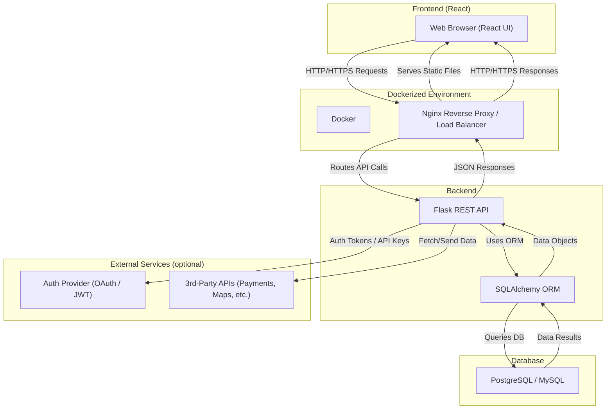

```mermaid
flowchart TD

subgraph Client["Frontend (React)"]
    Browser["Web Browser (React UI)"]
end

subgraph Server["Backend"]
    FlaskAPI["Flask REST API"]
    ORM["SQLAlchemy ORM"]
end

subgraph DB["Database"]
    SQL["PostgreSQL / MySQL"]
end

subgraph Deployment["Dockerized Environment"]
    Docker["Docker"]
    Nginx["Nginx Reverse Proxy / Load Balancer"]
end

subgraph External["External Services (optional)"]
    Auth["Auth Provider (OAuth / JWT)"]
    APIExt["3rd-Party APIs (Payments, Maps, etc.)"]
end

Browser -->|HTTP/HTTPS Requests| Nginx
Nginx -->|Routes API Calls| FlaskAPI
Nginx -->|Serves Static Files| Browser

FlaskAPI -->|Uses ORM| ORM
ORM -->|Queries DB| SQL
SQL -->|Data Results| ORM
ORM -->|Data Objects| FlaskAPI
FlaskAPI -->|JSON Responses| Nginx
Nginx -->|HTTP/HTTPS Responses| Browser

FlaskAPI -->|Auth Tokens / API Keys| Auth
FlaskAPI -->|Fetch/Send Data| APIExt

```
